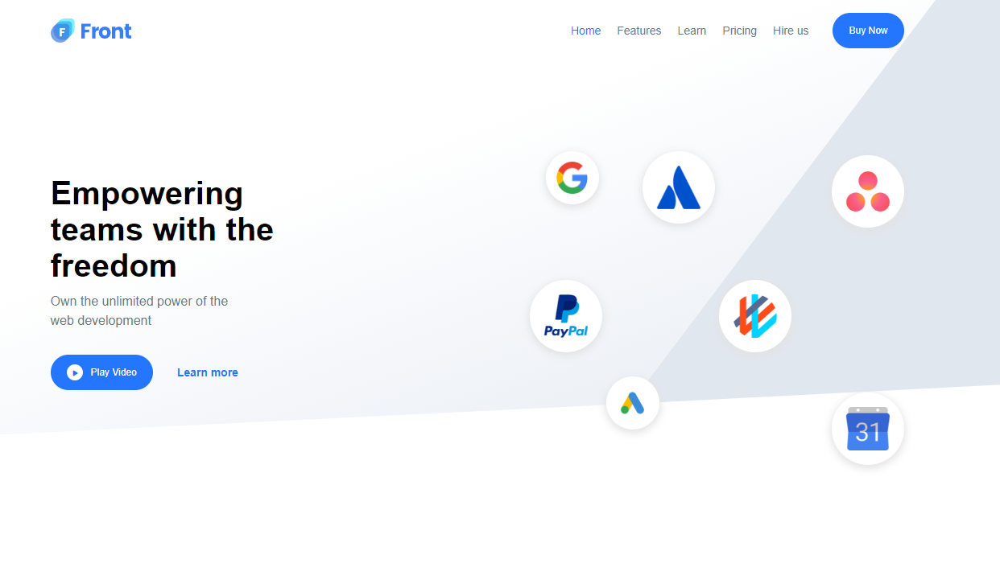
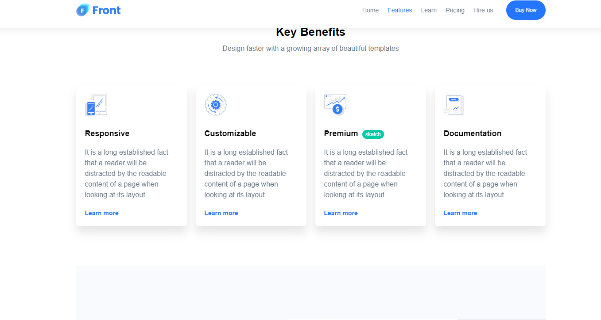
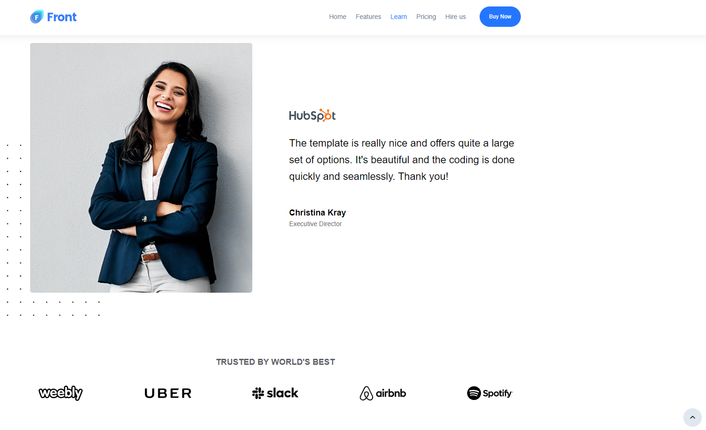
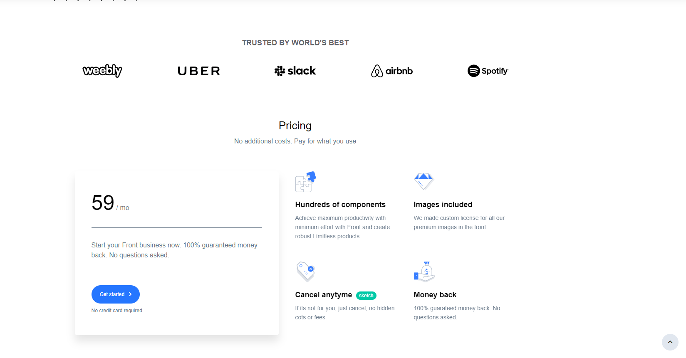
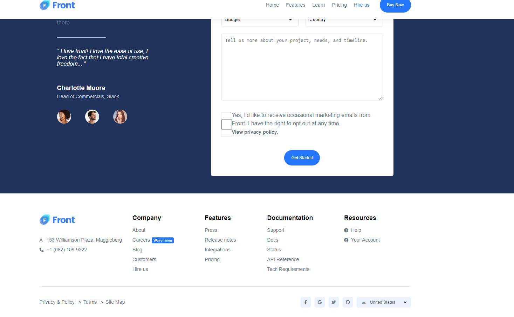

SaaS Website Demo

Welcome to the demo for a fully responsive SaaS website, designed and developed using HTML5, CSS, and JavaScript. This project highlights my front-end development skills, with a focus on creating responsive, modern web interfaces.

Features

Fully Responsive: Optimized for all screen sizes—mobile, tablet, and desktop.
Modern UI Design: Clean and intuitive user experience.
Lightweight: No external frameworks, purely built with HTML5, CSS, and vanilla JavaScript.
Fast Performance: Optimized for quick load times and efficient resource use.
Cross-browser Compatibility: Works across all major browsers (Chrome, Firefox, Safari, Edge).

Technologies Used

Frontend: HTML5, CSS3, JavaScript (ES6)
No Frameworks: This project was built entirely from scratch using only native web technologies.

How to Run Locally

Clone the repository:

git clone https://github.com/Amanuel-web/fully-featured-saas-website-ready

Navigate to the project directory:

cd your-repository

Open the index.html file in your browser:

open index.html

## Screenshots

Demo Link
You can view the live demo of this project [here](https://saas-responsive-webpage-by-aman.vercel.app/).
